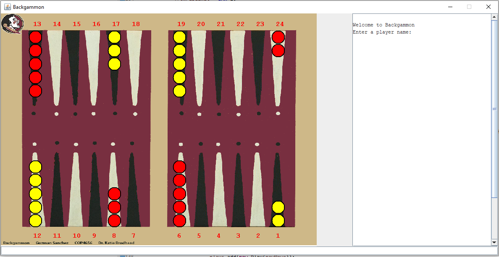
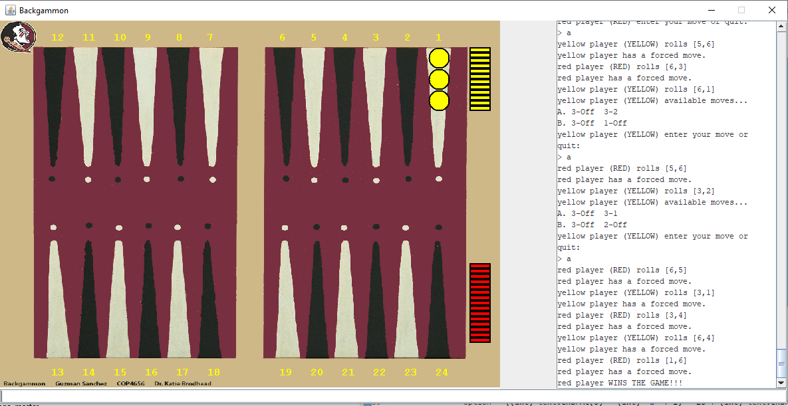

# java-project-backgamon

Backgammon Classic game by Guzman Sanchez

  
  
  

# Instructions
To start playing the program asks for the name of the players. As soon as both players 
named are entered, the Dice class will roll the dice, and whoever gets the greater roll starts. 
Info Panel displays a list of available moves according to the dice roll. The user types in 
the letter of the move and the checkers move. I.E. A. 24 - 20 24-21 will move both 
checkers from 24 pip to 20 and 21 respectively
